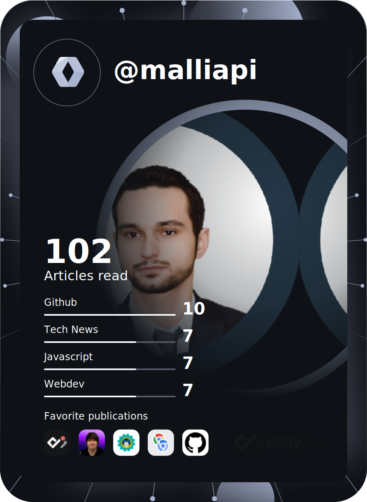

<h1 align="center">Hi 👋, I'm Chris Malliapi</h1>
<h3 align="center">Senior NextJS/ReactJS Developer</h3>

- 👨‍💻 All of my projects are available at [https://github.com/malliapi](https://github.com/malliapi)

- 📫 Reach me at 07583687616 or **chris@malliapi.co.uk**

### Profile

I am a full-stack developer and even though my focus has been on the front-end, I also possess strong leadership skills, back-end, architecture and DevOps skills. I am proactive about learning and regularly attend community conferences. I have a particular appreciation for visuals and usability and thus my career direction is focused towards enhancing these with the help of creative, UX and optimisation (A/B testing) teams. I have recently completed a contract with appnovation where a wordpress HR management was replaced by building a UI component library and then utilised through a contentful nextjs application. I am also involved in other projects such as a greenfield project called Popncorn Girl Las Vegas which is a franchise of https://popcorngirlvegas.com. This project is still at early discovery stages in terms of tech stack and now has first draft designs to work with.

Previously, I was the Technical Lead for search, bookings and checkout at Eurostar for close to 3 years where my team had delivered features that were worth circa £15 million in incremental revenue over my leadership period.

I had also previously led and managed technical teams at Deloitte Digital in London.

My responsibilities have included team management, leadership, client negotiation, hiring, requirements analysis, component design and implementation using TDD and BDD, code refactoring, and delivering application training to offshore locations.

I possess close to 12 years of professional and freelance work experience, including experience working in e-commerce, corporate financial institutions and technology consultancies.

I have graduated from University College London in 2008 with a 2:1 BSc(Hons) in Computer Science.

<h3 align="left">Connect with me:</h3>

<h3 align="left">Languages and Tools:</h3>

                                            

## Statistics (from public sources)

